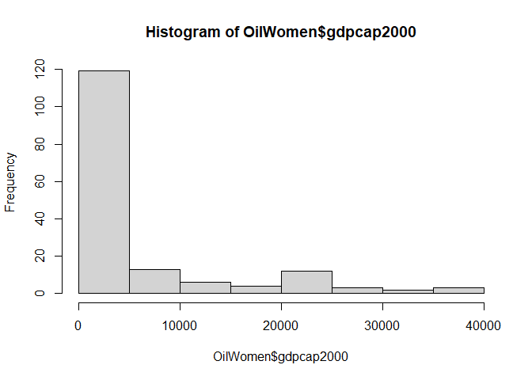
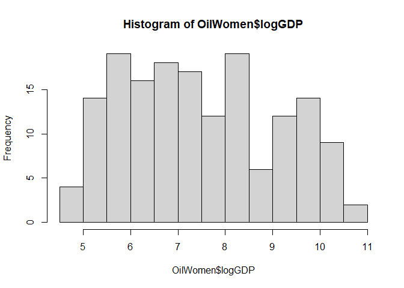
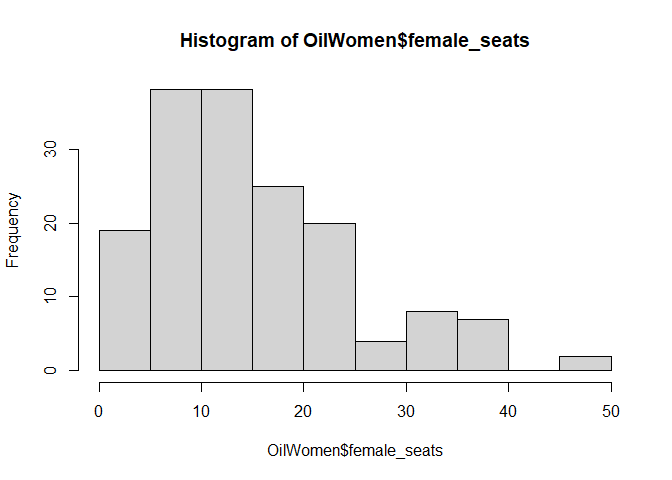
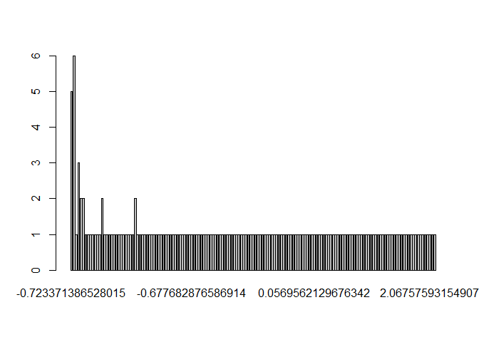
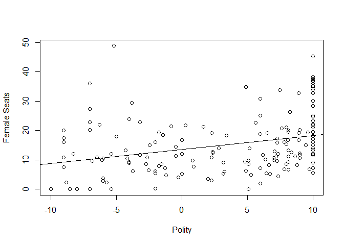

Writing Reports with R Markdown
================
2023-04-05

Here I use and message=FALSE adn warning = FALSE to hide the message
lines.

``` r
OilWomen<-read.csv('https://raw.githubusercontent.com/hknd23/PLSC-309-SP23/main/Data/oilwomen.csv')
library(devtools)
install_github('hknd23/MarginalEffectsPlots')
library(MarginalEffectsPlots)
library(stargazer)
```

## R Markdown

In this study, I want to look at the effect of economic growth, oil
exports, and having Islam as major religion on women representation.

First, I notice that GDP per capita is right-skewed, so I take the
logarithm of the variable so that it looks “normal”:

``` r
hist(OilWomen$gdpcap2000)
```

<!-- -->

``` r
OilWomen$logGDP<-log(OilWomen$gdpcap2000)
hist(OilWomen$logGDP)
```

<!-- -->

Now, I want to look at the descriptive statistics of my main variables

``` r
summary(OilWomen[,c('female_seats','polity','oil','zislam','logGDP','gdpcap2000','PR')])
```

    ##   female_seats       polity             oil                zislam       
    ##  Min.   : 0.00   Min.   :-10.000   Min.   :    0.000   Min.   :-0.7234  
    ##  1st Qu.: 8.30   1st Qu.: -2.932   1st Qu.:    0.000   1st Qu.:-0.7142  
    ##  Median :12.20   Median :  5.089   Median :    4.975   Median :-0.6062  
    ##  Mean   :14.96   Mean   :  2.790   Mean   :  662.702   Mean   : 0.0000  
    ##  3rd Qu.:20.10   3rd Qu.:  8.773   3rd Qu.:  126.817   3rd Qu.: 0.6034  
    ##  Max.   :48.80   Max.   : 10.000   Max.   :20818.754   Max.   : 2.0696  
    ##  NA's   :9                         NA's   :1                            
    ##      logGDP         gdpcap2000             PR        
    ##  Min.   : 4.581   Min.   :   97.64   Min.   :0.0000  
    ##  1st Qu.: 6.193   1st Qu.:  489.56   1st Qu.:0.0000  
    ##  Median : 7.372   Median : 1592.06   Median :1.0000  
    ##  Mean   : 7.472   Mean   : 5677.78   Mean   :0.6232  
    ##  3rd Qu.: 8.649   3rd Qu.: 5703.79   3rd Qu.:1.0000  
    ##  Max.   :10.586   Max.   :39568.07   Max.   :1.0000  
    ##  NA's   :8        NA's   :8          NA's   :32

## Including Plots

Third, I use some visualization to show some data trends

``` r
hist(OilWomen$female_seats)
```

<!-- -->

``` r
barplot(table(OilWomen$zislam))
```

<!-- -->

Note that the `echo = FALSE` parameter was added to the code chunk to
prevent printing of the R code that generated the plot.

<!-- -->

I now want to run two linear regression models:

``` r
model2<-lm(female_seats~logGDP+polity+oil,data=OilWomen)
model3<-lm(female_seats~polity+oil+zislam*logGDP+PR,data=OilWomen)
summary(model2)
```

    ## 
    ## Call:
    ## lm(formula = female_seats ~ logGDP + polity + oil, data = OilWomen)
    ## 
    ## Residuals:
    ##     Min      1Q  Median      3Q     Max 
    ## -15.519  -6.012  -1.571   4.403  38.453 
    ## 
    ## Coefficients:
    ##               Estimate Std. Error t value Pr(>|t|)    
    ## (Intercept) -0.2507307  3.9805191  -0.063  0.94986    
    ## logGDP       2.0696225  0.5692522   3.636  0.00038 ***
    ## polity       0.1138673  0.1487586   0.765  0.44520    
    ## oil         -0.0014680  0.0004388  -3.346  0.00104 ** 
    ## ---
    ## Signif. codes:  0 '***' 0.001 '**' 0.01 '*' 0.05 '.' 0.1 ' ' 1
    ## 
    ## Residual standard error: 8.875 on 151 degrees of freedom
    ##   (15 observations deleted due to missingness)
    ## Multiple R-squared:  0.1883, Adjusted R-squared:  0.1721 
    ## F-statistic: 11.67 on 3 and 151 DF,  p-value: 6.365e-07

``` r
summary(model3)
```

    ## 
    ## Call:
    ## lm(formula = female_seats ~ polity + oil + zislam * logGDP + 
    ##     PR, data = OilWomen)
    ## 
    ## Residuals:
    ##     Min      1Q  Median      3Q     Max 
    ## -18.477  -5.554  -1.365   3.690  32.634 
    ## 
    ## Coefficients:
    ##                 Estimate Std. Error t value Pr(>|t|)    
    ## (Intercept)    1.4609223  4.7871748   0.305   0.7607    
    ## polity        -0.3246544  0.2088373  -1.555   0.1226    
    ## oil            0.0000206  0.0007968   0.026   0.9794    
    ## zislam        13.0372808  6.2669175   2.080   0.0395 *  
    ## logGDP         1.2748165  0.6994497   1.823   0.0708 .  
    ## PR             6.6834572  1.6564440   4.035 9.45e-05 ***
    ## zislam:logGDP -2.2050942  0.9191009  -2.399   0.0179 *  
    ## ---
    ## Signif. codes:  0 '***' 0.001 '**' 0.01 '*' 0.05 '.' 0.1 ' ' 1
    ## 
    ## Residual standard error: 8.34 on 125 degrees of freedom
    ##   (38 observations deleted due to missingness)
    ## Multiple R-squared:  0.3183, Adjusted R-squared:  0.2855 
    ## F-statistic: 9.726 on 6 and 125 DF,  p-value: 8.858e-09

With an interaction term, let’s use the plotting functions to interpret
them more easily

``` r
meggplot(model3,'logGDP','zislam')
```

<!-- -->

``` r
meggplot(model3,'zislam','logGDP')
```

<!-- -->

After I’m done writing the report, I can use File \> Knit Document to
produce my report.
